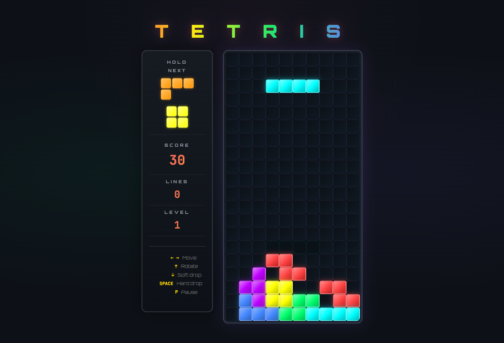

# Local AI-Powered Tetris

A fully-functional Tetris game built with React and Vite, generated from prompts using a locally running language model — **no cloud APIs**

## Demo

<div align="center">
  
</div>

## Motivation

The purpose of this repo is to demonstrate that a local, on-device AI can be trusted to produce production quality code when given clear prompts and feedback loops.

It serves as an example of context-driven development using local LLMs on consumer hardware — **no cloud LLM APIs, no proprietary service dependencies, no API tokens.**

### Tooling

| Tool         | Purpose                             |
|:-------------|:------------------------------------|
| [Ollama]     | Hosts LLMs locally on GPU           |
| [OpenCode]   | CLI agent powered by the local model|
| [Vite]       | Development server and bundler      |

### Model

The code was produced interactively using [Qwen3.6 27B Dense](https://ollama.com/library/qwen3.6) — a 27 billion parameter dense model. Running entirely **offline, on-device**.

## What It Does

A full-featured Tetris implementation:

- All 7 tetrominoes with a bag-randomizer (7-bag)
- Ghost piece shadow and next-up preview
- Scoring, leveling, and combo tracking
- Line clear, lock, and drop animations
- Web Audio API sound effects for every action
- Pause, resume, and game-over screens

### Controls

| Key       | Action   |
|:----------|:---------|
| ←  →      | Move     |
| ↑         | Rotate   |
| ↓         | Fast     |
| Spacebar  | Drop     |
| **P**     | Pause    |

## Getting Started

```bash
git clone https://github.com/r4yg/tetris.git
cd tetris
npm install
npm run dev
```

The game runs at `http://localhost:5173`.

For a production build:

```bash
npm run build
npm run preview
```

## Running the Model Locally

### Prerequisites

- [Ollama] installed on Ubuntu
- GPU setup: RTX 3090 (24 GB) + RTX 3060 (12 GB) = 36 GB total VRAM for running the dense model

### Ollama Setup

```bash
ollama pull qwen3.6:27b
```

### Using OpenCode

Start a local coding session with OpenCode, powered by the local model:

```bash
opencode
```

The project was developed through a complete OpenCode session workflow — starting with planning and spec definition, then breaking the work into tasks and implementing them iteratively. The agent scaffolded the project structure, wrote code task by task, reviewed and self-corrected across files, and polished the result through a harness-driven feedback loop.

## Project Structure

```
├── src/
│   ├── components/       # Board, SidePanel, GameOver
│   ├── App.jsx           # Game loop and state orchestration
│   ├── utils.js          # Board, piece, and collision helpers
│   ├── audioUtils.js     # Sound synthesis via Web Audio API
│   ├── index.css         # Global styles and keyframe animations
│   └── main.jsx          # Entry point
├── public/               # Static assets
└── index.html            # HTML shell
```

## Key Techniques Demonstrated

### Context-Driven Development

Each section of the game was developed through structured prompts. The model handled:

**Iteration.** Refining code based on correction feedback.

**Self-Correction.** The agent reviewed generated code, identified issues, and applied fixes across files.

**Architecture Decisions.** Choosing a 7-bag randomizer, Web Audio API for sound, and pure CSS animations.

### Local AI Advantages

- **Privacy** — code and prompts never leave the machine
- **No Rate Limits** — unlimited generations
- **No Cost** — free after the initial hardware investment
- **Full Ownership** — no vendor lock-in or license restrictions

## References

- [Ollama] — open-source LLM runner
- [OpenCode] — CLI agent for AI-assisted development
- [Vite] — next-generation frontend tooling
- [React 19] — UI framework
- [Web Audio API](https://developer.mozilla.org/en-US/docs/Web/API/Web_Audio_API) — sound synthesis

[Ollama]: https://ollama.com
[OpenCode]: https://github.com/opencode-ai/opencode
[Vite]: https://vitejs.dev
[React 19]: https://react.dev

## License

MIT
